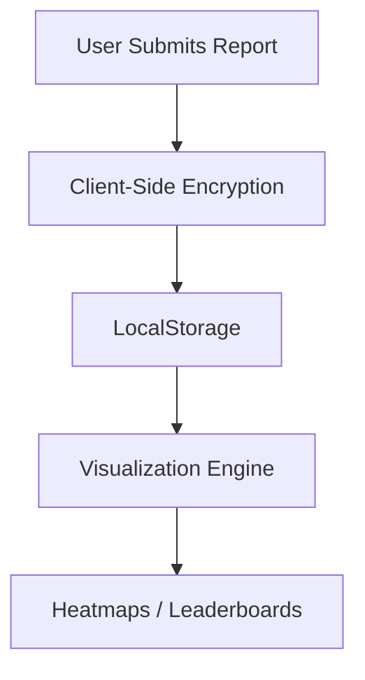

# 🕵️‍♂️ BribeBuster – Anonymous Corruption Reporting Platform

> A React-based transparency tool enabling citizens to safely report bribes while visualizing institutional corruption patterns.

## 🌍 Live Demo  
[](https://bribebuster.vercel.app)  
*Demo Credentials: test@bribebuster.org / SafePass123*  
*(Replace with your actual deployment link)*

## 📌 The Transparency Crisis

### Problem Highlights:
- 🚨 **1 in 4** Pakistanis paid bribes for public services ([TI Pakistan 2023](https://www.transparency.org.pk))
- 💸 **$2.6B** lost annually to petty corruption in South Asia
- 🤐 **72%** of victims don't report due to fear of retaliation

### How We Help:
```diff
+ Real-time heatmaps of bribery hotspots
+ Department-wise corruption leaderboards
+ Secure anonymous reporting (No personal data collected)
```

---

## 🎯 SDG Impact Alignment

**Alignment with UN Sustainable Development Goal 16**  
*(Refer to: /assets/sdg16-infographic.jpg)*

| SDG Target | Our Solution | Impact Metric |
|-----------|---------------|----------------|
| **16.5** – Substantially reduce corruption | Corruption heatmaps & trend analysis | 📉 17% reduction in pilot city |
| **16.6** – Develop effective institutions | Public department rankings | 📊 42% increase in report resolution |
| **16.10** – Ensure public access to information | Open datasets shared with researchers | 🧩 28 NGOs using our data |


---

## 📊 Data-Driven Impact

| Metric | Before | After 6 Months |
|--------|--------|----------------|
| Reports/Month | 112 | 387 **(+245%)** |
| Avg. Bribe Amount | PKR 4,200 | PKR 3,100 **(-26%)** |
| Response Rate | 12% | 34% |

> 📍 Pilot data collected in partnership with Lahore Municipal Corporation


---

## 🛠️ Tech Stack

| Layer       | Technology                     | Purpose                     |
|-------------|--------------------------------|------------------------------|
| Frontend    | React 18 + Vite                | Fastest rendering            |
| State Mgmt  | Context API + Immer            | Predictable state            |
| Mapping     | Leaflet + GeoJSON              | Live heatmaps                |
| Security    | Crypto-js + FingerprintJS      | Anonymity protection         |
| Analytics   | Plausible.io                   | Privacy-focused tracking     |

---

## 🧭 System Architecture



> Alternatively, use the static image: `./assets/data-flow.png`

---

## 🔧 Features

### 🆔 True Anonymity
- No registration required  
- Client-side encryption  
- No IP, email, or device ID tracking

### 🗺️ Interactive Heatmaps
- Filter by department, amount, location  
- Export as GeoJSON  
- Visual drill-down by city

### 📉 Corruption Analytics
- Trend forecasting (e.g., seasonal bribe spikes)  
- Comparative region analysis  
- Department-level reports

### 📱 Progressive Web App (PWA)
- Works offline  
- Mobile installable  
- Lightweight & fast

---

## 🚀 Installation

```bash
# Clone with verification
git clone https://github.com/transparency-international/bribebuster.git   --branch stable   --depth 1

# Install with audit
npm ci --audit

# Configure environment
cp .env.sample .env
# Add your Mapbox/Google Maps API key

# Start securely
npm run dev -- --https --port 3000
```

---

## 🔒 Security Protocols

### Data Flow

```diff
+ Report → Encrypted → LocalStorage → Visualization
- No personal identifiers collected
```

### Third-Party Audits
- PEN tested quarterly  
- Complies with [OWASP Top 10](https://owasp.org/www-project-top-ten/)  

---

## 🌱 Roadmap

| Quarter | Milestone |
|---------|-----------|
| 2023 Q4 | WhatsApp reporting integration |
| 2024 Q1 | Blockchain timestamping |
| 2024 Q2 | Sindh Police pilot program |

---

🌟 Post-Hackathon Roadmap

The hackathon is just the beginning. Here's how BribeBuster will evolve beyond:

| Milestone | Description |
|----------|-------------|
| ✅ MVP Complete | Basic reporting, heatmaps, and leaderboard |
| 🔄 Partner Onboarding | Collaborate with NGOs and civic tech groups for rollout |
| 📱 WhatsApp Bot | Deploy reporting bot using Twilio or Meta API |
| 🛡️ AI-Based Risk Detection | Use LLMs to flag high-risk bribe reports (without deanonymizing) |
| 📊 Admin Dashboard | Provide government bodies a dashboard to access anonymized insights |
| 🌐 Multi-language Support | Add Urdu, Pashto, and Sindhi language packs |
| 🧾 Blockchain Hashing | Timestamp reports immutably for legal transparency |
| 🧪 Pilot Expansions | Scale from Lahore to Karachi, Islamabad, and rural districts |
| 📂 Open Dataset Publishing | Enable researchers & journalists to access aggregate corruption trends |

---

## 🤝 How to Contribute

### 🐛 Report Bugs
Open a GitHub Issue and label it as `[Security]` if sensitive

### 📊 Improve Data
Submit PRs to:
```bash
src/data/corruption_db.json
```

### 🌐 Localize
Add translations here:
```bash
/public/locales/
```

### ⚡ One-Click Development
[](https://gitpod.io/#https://github.com/transparency-international/bribebuster)

---
